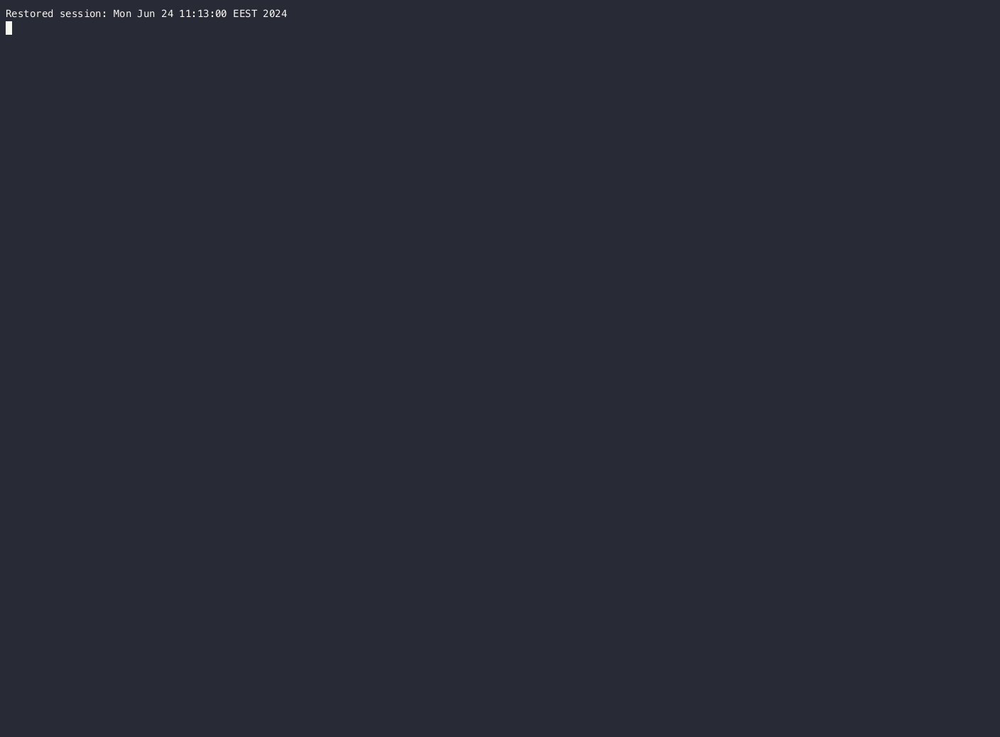

# tsellm: Use LLMs in SQLite

[](https://github.com/Florents-Tselai/tsellm)
[](https://pypi.org/project/tsellm/)
[](http://tsellm.tselai.com/en/latest/?badge=stable)
[](https://pypi.org/project/tsellm/)
[](https://github.com/Florents-Tselai/tsellm/actions?query=workflow%3ATest)
[](https://codecov.io/gh/Florents-Tselai/tsellm)
[](https://github.com/Florents-Tselai/tsellm/blob/main/LICENSE)

**tsellm** is the easiest way to access LLMs through your SQLite database.

```shell
pip install tsellm
```

```shell
usage: tsellm [-h] [--sqlite | --duckdb] [-v] [filename] [sql]

Use LLMs in SQLite and DuckDB

positional arguments:
  filename       SQLite/DuckDB database to open (defaults to SQLite ':memory:').
                 A new database is created if the file does not previously exist.
  sql            An SQL query to execute. Any returned rows are printed to
                 stdout.

options:
  -h, --help     show this help message and exit
  --sqlite       SQLite mode
  --duckdb       DuckDB mode
  -v, --version  Print tsellm version

```

Behind the scenes, **tsellm** is based on the beautiful [llm](https://llm.datasette.io) library,
so you can use any of its plugins:

## Generative

For example, to access `gpt4all` models

```shell
llm install llm-gpt4all
# Then pick any gpt4all (it will be downloaded automatically the first time you use any model
tsellm :memory: "select prompt('What is the capital of Greece?', 'orca-mini-3b-gguf2-q4_0')"
tsellm :memory: "select prompt('What is the capital of Greece?', 'orca-2-7b')"
```

## Embeddings

```shell
llm install llm-sentence-transformers
llm sentence-transformers register all-MiniLM-L12-v2
tsellm :memory: "select embed('Hello', 'sentence-transformers/all-MiniLM-L12-v2')"
```

### Embeddings for binary (`BLOB`) columns

```shell
wget https://tselai.com/img/flo.jpg
sqlite3 images.db <<EOF
CREATE TABLE images(name TEXT, type TEXT, img BLOB);
INSERT INTO images(name,type,img) VALUES('flo','jpg',readfile('flo.jpg'));
EOF
```

```shell
llm install llm-clip
tsellm images.db "select embed(img, 'clip') from images"
```

## Examples

Things get more interesting if you
combine models in your standard queries.

First, create a db with some data.
You can easily toggle between SQLite and DuckDB,
and **tsellm** will pick this up automatically.

### SQLite
```bash
sqlite3 prompts.db <<EOF
CREATE TABLE prompts (
   p TEXT
);
INSERT INTO prompts VALUES('hello world!');
INSERT INTO prompts VALUES('how are you?');
INSERT INTO prompts VALUES('is this real life?');
INSERT INTO prompts VALUES('1+1=?');
EOF
```

With a single query you can access get prompt 
responses from different LLMs:

```sql
tsellm prompts.db "
        select p,
        prompt(p, 'orca-2-7b'),
        prompt(p, 'orca-mini-3b-gguf2-q4_0'),
        embed(p, 'sentence-transformers/all-MiniLM-L12-v2') 
        from prompts"
```

### DuckDB

```bash
duckdb prompts.duckdb <<EOF
CREATE TABLE prompts (
   p TEXT
);
INSERT INTO prompts VALUES('hello world!');
INSERT INTO prompts VALUES('how are you?');
INSERT INTO prompts VALUES('is this real life?');
INSERT INTO prompts VALUES('1+1=?');
EOF
```

With a single query you can access get prompt 
responses from different LLMs:

```sql
tsellm prompts.duckdb "
        select p,
        prompt(p, 'orca-2-7b'),
        prompt(p, 'orca-mini-3b-gguf2-q4_0'),
        embed(p, 'sentence-transformers/all-MiniLM-L12-v2') 
        from prompts"
```


## Interactive Shell

If you don't provide an SQL query,
you'll enter an interactive shell instead.

```shell
tsellm prompts.db
```



## Installation

```bash
pip install tsellm
```

## How

**tsellm** relies on the following facts:

* SQLite is bundled with the standard Python library (`import sqlite3`)
* Python 3.12 ships with a [SQLite interactive shell](https://docs.python.org/3/library/sqlite3.html#command-line-interface)
* one can create Python-written user-defined functions to be used in SQLite 
  queries (see [create_function](https://github.com/simonw/llm))
* [Simon Willison](https://github.com/simonw/) has gone through the process of 
  creating the beautiful [llm](https://github.com/simonw/llm) Python 
  library and CLI

## Development

```bash
pip install -e '.[test]'
pytest
```

